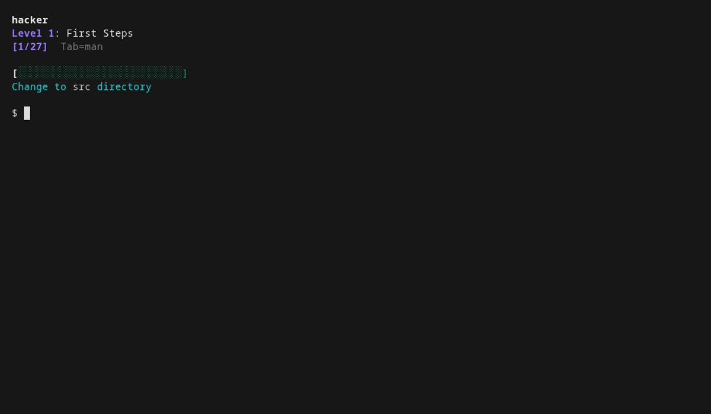

# cmdchamp

Pure bash CLI trainer — 30 levels from `ls` to privilege escalation.



Drill real commands until they're muscle memory. Every question asks you to type a real command — get instant feedback, move on. Many questions run against real files in the sandbox, all accept multiple valid syntaxes (both `sort -u` and `sort | uniq`), and Tab pulls up the manpage when you need a reference. Randomized each run so you can't memorize the order. A mastery system tracks what you know and what you don't: get a question right twice to master it, get it wrong and it demotes so you see it again sooner. Hit a 5-answer streak and you enter fire mode for bonus points.

Each level ends with a boss round — no manpages, 4/5 to pass. Fail and you can retry the boss immediately or go back to practice. Beat all 30 and challenge mode unlocks — random questions from all levels, 20s timer, no manpages, one miss and you're done. Each level auto-mixes weak questions from previous levels so you stay sharp. First run includes a short tutorial.

With [bubblewrap](https://github.com/containers/bubblewrap), commands run in a real sandboxed filesystem. Without it, answers are text-matched. Search levels (16-17) accept both modern (`rg`, `fd`) and classic (`grep`, `find`) syntax. Vi line editing built in.

### How scoring works

Each question has three mastery tiers (unseen → learning → mastered). Get it right to promote, wrong to demote. Tab toggles the manpage for the relevant command — a reference, not a spoiler. You still have to figure out the answer yourself.

## Install

```bash
mkdir -p ~/.local/bin && curl -sL https://raw.githubusercontent.com/mellen9999/cmdchamp/main/cmdchamp -o ~/.local/bin/cmdchamp && chmod +x ~/.local/bin/cmdchamp
```

Add `~/.local/bin` to PATH if needed: `echo 'export PATH="$HOME/.local/bin:$PATH"' >> ~/.bashrc`

**Or clone:**

```bash
git clone https://github.com/mellen9999/cmdchamp.git
cd cmdchamp && make install
```

**Requires:** bash 4.3+, coreutils, awk

**macOS:** Ships with bash 3.2 — install modern bash first: `brew install bash`

**Optional:** [bubblewrap](https://github.com/containers/bubblewrap) (`bwrap`) for sandbox mode (Linux only) — most desktop distros include it. Without it, answers are text-matched only

## Usage

```bash
cmdchamp                # Game menu (j/k to navigate, Enter to select)
cmdchamp --no-sandbox   # Menu without sandbox (text-match only)
cmdchamp reset          # Clear all progress
```

## Levels

| # | Name | Focus |
|---|------|-------|
| | **Fundamentals** | |
| 1 | First Steps | pwd, ls, echo, cd, mkdir |
| 2 | Save Your Work | >, >>, tee |
| 3 | Reading Files | cat, head, tail, less |
| 4 | Basic Pipes | pipes, grep, wc, sort, uniq |
| 5 | Input Redirection | <, file→stdin |
| 6 | Here-Strings | <<<, tr, cut, rev, bc |
| 7 | Error Handling | 2>, 2>&1, &>, /dev/null |
| 8 | Logic Gates | &&, \|\| |
| 9 | Variables | `$VAR`, assignment, expansion |
| 10 | Special Variables | `$$`, `$?`, `$!`, `$#`, `$@`, `$0` |
| 11 | Job Control | bg, fg, jobs, &, Ctrl+Z |
| 12 | Test Conditions | -f, -d, -z, -n, -eq, -lt |
| 13 | Core File Tools | cp, mv, ln, chmod, du, tar, diff |
| 14 | System Admin | ping, df, free, ss, systemctl, ip |
| 15 | Multiplexers | tmux: sessions, windows, panes |
| 16 | Text Search | grep, ripgrep, regex |
| 17 | File Finding | find, fd, by name/size/time/type |
| 18 | Data Processing | sort, uniq, cut, awk, tr, comm |
| 19 | String & Arrays | parameter expansion, arrays |
| 20 | Control Flow | if/else, loops, case, functions |
| 21 | Batch Ops | find -exec, xargs, sed -i, crontab |
| 22 | Advanced Regex | lookahead, sed, awk |
| | **DevOps & Security** | |
| 23 | Git | branches, remotes, rebasing, stashing, bisect |
| 24 | Network Tools | tshark, curl, jq, ssh tunnels, openssl, SMB |
| 25 | Network Scanning | nmap, service detection, scripts |
| 26 | WiFi & RF | aircrack-ng, netcat, tcpdump, wireless recon |
| 27 | Hash Cracking | hashcat, john, hydra, encoding |
| 28 | Forensics | strings, readelf, binwalk, volatility, exiftool |
| 29 | Privilege Escalation | SUID, GTFOBins, enumeration |
| 30 | ROOT | emergency recovery, chroot, offline survival |

## Scenarios

Multi-step sandbox challenges — state persists between steps.

| # | Name | Unlocks at | Steps |
|---|------|-----------|-------|
| 1 | The Broken Deploy | L21 boss | 7 |
| 2 | Log Emergency | L21 boss | 5 |
| 3 | Messy CSV | L18 boss | 4 |
| 4 | Permission Lockout | L13 boss | 6 |
| 5 | Find the Needle | L16 boss | 7 |
| 6 | Archive & Extract | L13 boss | 6 |
| 7 | The Incident | L18 boss | 5 |
| 8 | Config Surgery | L21 boss | 5 |

## Placement test

First run includes an automatic placement test after the tutorial — 2 questions per level, 20s each, no manpages. Miss one and that's your starting level.

## Floppy disks

8 hidden floppy disks to collect. `cmdchamp stats` shows how many you've found.

## Controls

| Key | Action |
|-----|--------|
| Enter | Submit answer |
| Tab | Toggle manpage |
| Ctrl+d | Quit (session summary) |
| Esc | Vi normal mode |
| ? | All keybindings (normal mode) |

## Data

Progress saves to `${XDG_DATA_HOME:-~/.local/share}/cmdchamp/`.

## License

MIT
